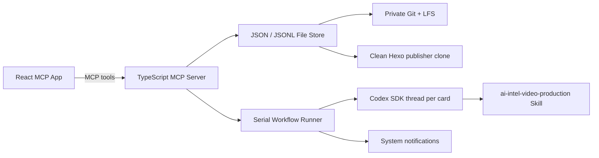

# Architecture

The MCP tools remain complete without the UI. `open_board` associates the `ui://ai-creator-board/board-v1.html` resource through `_meta.ui.resourceUri`; the resource uses the MCP Apps MIME type `text/html;profile=mcp-app` and the standard `ui/*` bridge.

## Execution invariants

- Only one Worker mutation runs at a time.
- A task can only follow the approved state graph.
- The active-device lease must match before every mutation.
- The data repository must be clean and fast-forwardable before mutation.
- A task version mismatch rejects the write instead of overwriting newer state.
- Four PASS reviews and the complete artifact contract are required for completion.
- Technical failures never become business completion.
